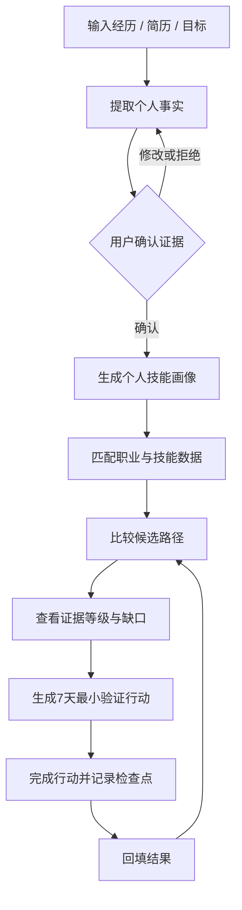

# 用户流程

## 从“我不知道”到“我先验证一下”

## 每一步的产品价值

### 01｜输入

用户提供自己的经历、目标或困惑。系统不要求用户先把问题说得非常专业。

### 02｜提取

AI 将长文本转成结构化事实、技能和经历候选，减少用户整理材料的成本。

### 03｜确认

用户可以确认、修改或拒绝 AI 提取的内容。个人画像不是模型单方面写下的结论。

### 04｜匹配

系统将确认过的个人证据与职业和技能数据连接起来，寻找相邻职业和可能路径。

### 05｜比较

用户同时查看多条候选路径，看到每条路径的依据、技能差距、证据等级和信息缺口。

### 06｜验证

系统把方向判断变成一项 7 天内可完成的行动，例如访谈、作品验证、岗位样本分析或技能小任务。

### 07｜回流

用户记录完成情况、发现和结果。下一次建议不再只依赖通用模型，而是参考自己的真实决策轨迹。

## 30 秒讲解词

> 我们先不急着告诉用户该选什么，而是先整理他已经拥有的真实证据，再把这些证据放进职业和技能数据里比较。系统会给出多条路径，并告诉用户每条路径的依据和缺口。最后，它不会要求用户立刻做一个重大决定，而是给出一个 7 天内可以完成的小实验，用行动验证方向。实验结果再回到下一次决策里。
